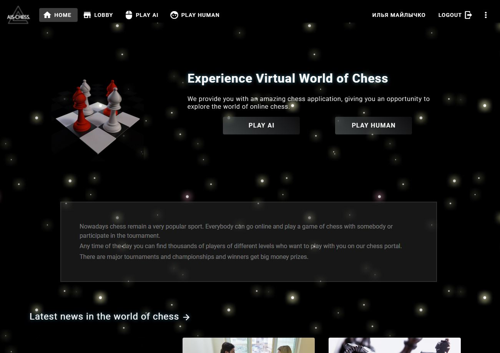
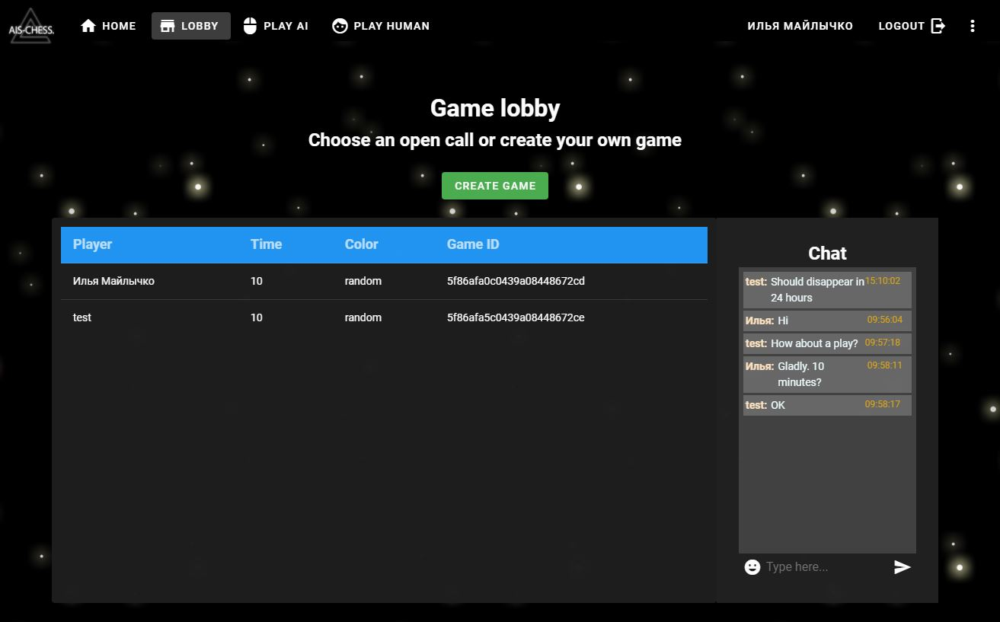
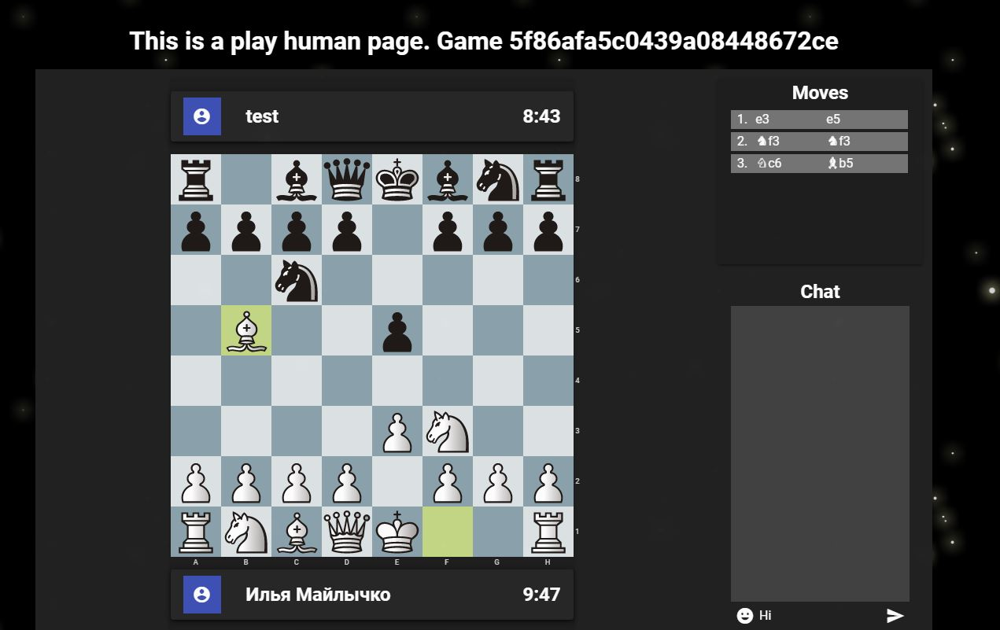
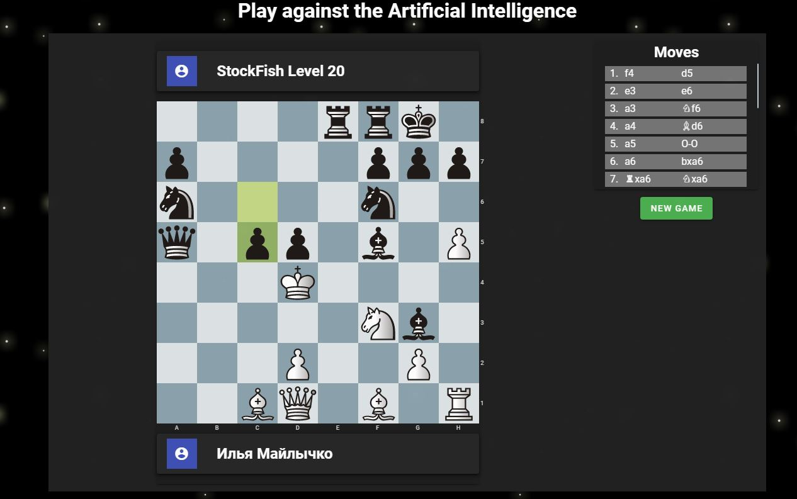
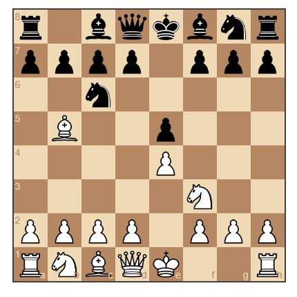

# Chess portal

## Description
AIS-chess is a chess portal where people can meet to play chess, communicate about chess and get information about chess. 

### Structure of the site:

The AIS-chess site is composed of theese essential parts:
### Homepage:
- On the **Homepage** you can get information about the game, read some news and start the game against a computer or a human.
### Game lobby:
- To start a game the user must create a call or choose an open call on the **Game lobby** page - a virtual waiting area. During the game creating process the user can choose the coler between "white", "black" and "random" and time-limit. The users must be logged in to have the possibility to play with other users.

In the lobby the players can communicate with each other in the global chatroom. 

### Game against a human:
- After a user has choosen an open call, the both players are redirected to the **Play against a human** page, where they can start the battle. This page also has a private chat, where players can communicate to each other.

### Game against the Artificial Intelligence:
- To start the game against the **Artificial Intelligence** the user doesn't need any authentication - everyone can play. The used chess engine is [Stockfish](https://stockfishchess.org/) - one of the strongest chess engines in the world. However the player isn't doomed to loss. It is possible to choose between 20 difficulty levels.
The level 0 is extremely easy, so even an inexperienced chess amateur can outplay it. The level 20 is extremely hard. No human being can outplay it.

- **Personal** area with personal information and statistics.

## Technology stack
### Frontend:
- Vue.js
- vuetify (Vue Material Design Component Framework)
- axios (Ajax library)
- vuex
- socket.io 
### Backend
- Node.js 
- MongoDB (please read about the Portable [Game Notation-format](https://en.wikipedia.org/wiki/Portable_Game_Notation) and you will see, how convenient it is to store such data in MongoDB-documents)
- Passport.js
- Express.js
- socket.io
### Chess
 - [chess.js](https://github.com/jhlywa/chess.js)-library for moves validation
 - [Stockfish](https://stockfishchess.org/) - One of the strongest chess engines.
 
 The chess engine works in a separate thread, so called Web Worker, which doesn't affect the performance of the user interface. The communication between the page and chess engine is carried out by the means of Web Worker messages.
 
The chess engine uses the [Universal Chess Interface (UCI)-protocol](https://www.shredderchess.com/chess-info/features/uci-universal-chess-interface.html) to set up and game analysis.
 - [chessground](https://github.com/ornicar/chessground)-library for board representation.
 
 
It exists also a much more better documented library [Chessboard.js](https://chessboardjs.com/), which was the first idea to use. However it has as a dependency jQuery, which we didn't want to use in the project.

 
 
